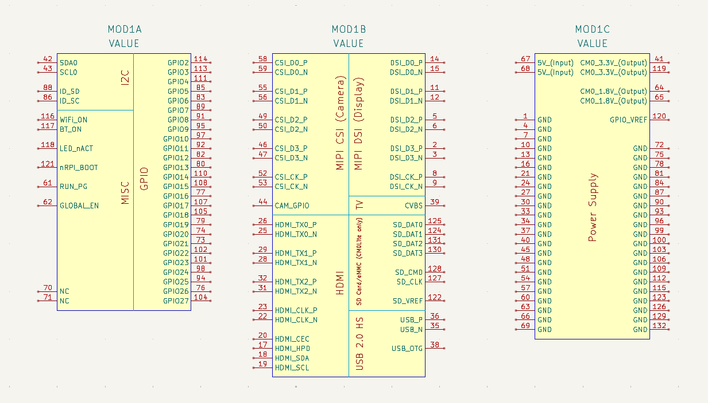
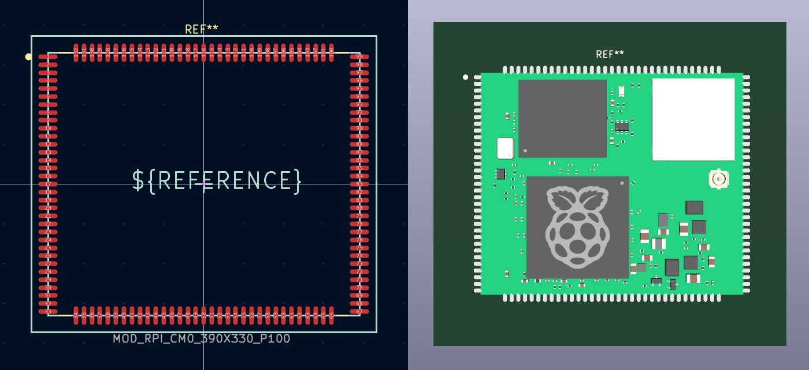

# Raspberry Pi Compute Module 0 (CM0) — SCH/PCB library component

This repository provides unofficial schematic symbol and PCB footprint library components for the Raspberry Pi Compute Module 0 (CM0).

The components were created primarily for Raspberry Pi ecosystem enthusiasts and for developing open-source / open-hardware projects based on the CM0 module.

## Library Files

This repository contains library components in the following EDA formats: Altium Designer and KiCad.

The KiCad schematic and PCB library components were created by importing the original Altium Designer library files and adapting them for KiCad use.

> **Note:** This is an unofficial library component. It is not created, endorsed, maintained, or distributed by Raspberry Pi Ltd.

## Schematic Symbol

The schematic symbol includes the CM0 pinout defined using the updated Raspberry Pi CM0 documentation, dated **8 July 2026**.

To improve schematic readability, the symbol is divided into three functional sections:

1. **Low-Speed Interfaces — GPIO / I2C / MISC**
2. **High-Speed Interfaces**
3. **Power Supply**

This structure is intended to make the CM0 easier to integrate into carrier-board designs, especially where multiple interfaces, power domains, and high-speed signals are used.

Preview of the Altium Designer symbol:

Preview of the KiCad symbol:

## PCB Footprint

The PCB footprint integrates a detailed 3D model and is intended for use when designing PCB boards for dedicated CM0 carrier boards.

Preview of the Altium Designer PCB footprint:

Preview of the KiCad PCB footprint:

## Official Documentation and Reference Design

Always verify the library components and your carrier-board design against the latest official documentation before manufacturing or deploying hardware.

### English Documentation

Official Raspberry Pi CM0 documentation in English:

- **CM0 Datasheet**  
  [Raspberry Pi Compute Module 0 Datasheet — English](https://pip.raspberrypi.com/documents/compute-module-0/CM0-Datasheet.pdf](https://pip-assets.raspberrypi.com/categories/1286-raspberry-pi-compute-module-zero/documents/RP-009251-DS-3-cm0-datasheet.pdf)

- **CM0 Product Brief**  
  [Raspberry Pi Compute Module 0 Product Brief — English](https://pip-assets.raspberrypi.com/categories/1286-raspberry-pi-compute-module-zero/documents/RP-009404-MM-1-Compute%20Module%20Zero%20product%20brief.pdf)

### Chinese Documentation

Official Raspberry Pi CM0 documentation in Chinese:

- **CM0 Datasheet**  
  [Raspberry Pi Compute Module 0 Datasheet — Chinese]([https://pip.raspberrypi.com/documents/compute-module-0/CM0-Datasheet-CN.pdf](https://edatec.cn/docs/zh/cm0/ds/1-cm0/#_4-2-%E5%BC%95%E8%84%9A))

### EDATEC CM0 Reference Design

EDATEC provides a CM0 reference design that may be useful when developing a custom carrier board.

- **CM0 Reference Design Schematic and PCB Files — KiCad**
- [EDATEC CM0 Reference Design - Schematic (PDF)](https://edatec.cn/storage/file/CM0%20IO%20Rev1%20SCH.pdf)
- [EDATEC CM0 Reference Design - KiCad source files](http://edatec.cn/storage/zip/20250920/d4be7476d8ce5a5a77f645ab08e852c5.zip)
  
## Pinout Notes

### Pin #120 — `GPIO_VREF`

Particular attention was given to **pin 120: `GPIO_VREF`**.

Earlier revisions of the English CM0 documentation contained an inconsistency regarding this pin. This issue was also discussed by users on the Raspberry Pi Forum. Before July 2026, the Chinese and English documentation described this pin differently, which could cause confusion during carrier-board design.
Now both datasheets (English and Chinese versions) are the same and correct regarding pinout definition.

Reference (Raspberry Pi forum): https://forums.raspberrypi.com/viewtopic.php?t=397265

## CM0 Availability

The Raspberry Pi Compute Module 0 was introduced in **September 2025**, around the China International Industry Fair (CIIF) in Shanghai.

CM0 is a compact, cost-optimized SOM based on the same general platform as the Raspberry Pi Zero 2 W, reformatted as a castellated module intended to be soldered onto dedicated carrier boards.

According to public reporting and statements attributed to Raspberry Pi representatives, CM0 was initially designed primarily for the **Chinese OEM and industrial market** rather than for broad worldwide retail distribution.

Raspberry Pi founder Eben Upton described CM0 as a cost-engineered modular product for the Chinese OEM market. At the time, Raspberry Pi indicated that there were no immediate plans for official availability outside China, while leaving open the possibility that this could change in the future.

CM0 modules and related products have been associated with the Chinese Raspberry Pi ecosystem and partners such as EDATEC. Availability outside China may occur through third-party channels, distributors, development boards, or unofficial importers, but this should not be considered equivalent to official global distribution.

For more background, see:

- [Hackster.io — Raspberry Pi Unveils the $18 Compute Module 0, but Only for Chinese Customers for Now](https://www.hackster.io/news/raspberry-pi-unveils-the-18-compute-module-0-but-only-for-chinese-customers-for-now-913bf59ab6cc)
- [Jeff Geerling — CM0: A New Raspberry Pi You Can’t Buy](https://www.jeffgeerling.com/blog/2025/cm0-new-raspberry-pi-you-cant-buy/)
- [Jeff Geerling on YouTube — Why is Raspberry Pi only selling this in China?](https://www.youtube.com/watch?v=Q6FIcyhjoVo)
- [EDATEC — Raspberry Pi Compute Module 0](https://edatec.cn/cm0)
- [CNX Software — Raspberry Pi CM0 availability through AliExpress](https://www.cnx-software.com/2026/04/27/raspberry-pi-cm0-system-on-module-is-now-sold-for-33-and-up-on-aliexpress/)

## Motivation

The Raspberry Pi CM0 has significant potential as a compact and affordable platform for custom embedded products, industrial devices, educational hardware, IoT systems, compact computers, and dedicated carrier-board designs.

The purpose of this project is to:

- make it easier to create CM0 carrier boards;
- provide reusable, open library components for the community;
- support enthusiasts, students, makers, and hardware developers;
- encourage the development of open-hardware projects based on CM0;
- help popularize the CM0 platform outside its currently limited market availability;
- draw attention to the potential value of making CM0 more broadly and officially available worldwide.

A globally available CM0 could become an attractive option for many projects that need a compact Linux-capable SOM but do not require the performance, size, power consumption, or cost of larger Compute Module platforms.

## Disclaimer

This project is provided for educational and reference purposes only.

The hardware design, schematics, PCB layouts, documentation, and all accompanying files are provided "AS IS", without warranty of any kind, express or implied, including but not limited to the warranties of merchantability, fitness for a particular purpose, and non-infringement.

Although every effort has been made to ensure the correctness of this design, the documentation and source files may contain errors, omissions, or inaccuracies. Users are solely responsible for verifying the design before manufacturing, assembly, or use in any application.

The author assumes no responsibility or liability for any direct, indirect, incidental, consequential, or special damages arising from the use of this project, including but not limited to hardware damage, data loss, financial loss, production failures, or personal injury.

Use this project entirely at your own risk.

## License

This project is released under the **CERN Open Hardware Licence Version 2 – Strongly Reciprocal (`CERN-OHL-S-2.0`)**.

License file: [Hardware License](LICENSE-HARDWARE.txt)

### What does this mean?

The **Strongly Reciprocal** variant is the most robust version of the CERN Open Hardware Licence.

It ensures that the hardware remains open. If you make modifications to these design files and distribute them, or distribute products based on them, you are required to share those modifications under the same `CERN-OHL-S-2.0` license.

This protects the project from becoming closed source while allowing commercial use, provided that the spirit of open hardware is maintained.
